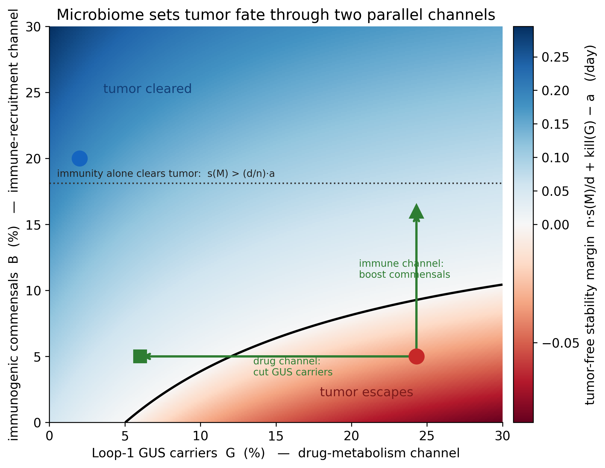
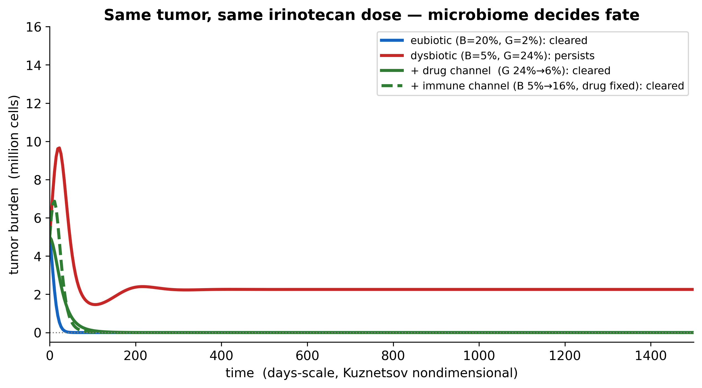

# Microbiome control of chemotherapy outcome: two parallel channels

A minimal, reproducible model of how the gut microbiome decides a chemotherapy outcome through **two
independent channels** that feed the same tumor-immune system. The drug is irinotecan (colorectal
cancer), the tumor-immune core is Kuznetsov et al. (1994), and the microbiome enters at exactly the
two points the Gollwitzer et al. (2025) hierarchical-control framework allows: the drug-efficacy term
and the immune-recruitment term.

- **Drug-metabolism channel.** Loop-1 gut beta-glucuronidase (GUS) carriers `G` reactivate SN-38 in
  the gut, force irinotecan dose reductions, and erode the delivered kill-rate: `kill(G) = D/(1+k*G)`.
- **Immune-recruitment channel.** Immunogenic commensals `B` raise effector-immune recruitment
  `s(M) = s0 + s1*B` — the reference framework's own recruitment law.

At the same dose a dysbiotic patient (few commensals, high GUS) loses the tumor to escape, and the
same patient is rescued by **either** lever alone: cut GUS to restore the drug, **or** boost
commensals to raise immunity with the drug left eroded.





## Mechanism

**Drug channel.** Irinotecan → SN-38 (the cytotoxin) → liver attaches a glucuronide → SN-38G → gut →
bacterial GUS removes the glucuronide, reactivating SN-38 in the gut → dose-limiting toxicity → dose
reductions → less drug reaches the tumor. Loop-1 (L1) GUS are the efficient reactivators (Pollet et
al. 2017), so `G` sets how much delivered dose is lost.

**Immune channel.** Gut commensals such as Faecalibacterium / Ruminococcaceae, Akkermansia and
Bifidobacterium raise anti-tumor effector-immune infiltration and checkpoint-therapy response
(Gopalakrishnan et al. 2018; Routy et al. 2018), so `B` sets the immune recruitment `s(M)`.

## Model

Kuznetsov (1994) fast tumor-immune dynamics (report Eq. 1), tumor cells `C_T`, effector immune `C_I`:

```
dC_T/dt = a*C_T - b*C_T^2 - n*C_T*C_I - kill(G)*C_T
dC_I/dt = s(M) - d*C_I + r*C_T*C_I/(h + C_T) - m*C_T*C_I
```

Two microbiome channels, in the same saturating / affine forms the reference framework uses:

```
kill(G) = D / (1 + k*G)      # drug efficacy eroded by GUS load G     (report kappa(p) = k0/(1+p))
s(M)    = s0 + s1*B          # immune recruitment raised by commensals (report s(M) = s0 + sum s_i M_i)
```

Linearising Eq. (1) at the tumor-free state `(C_T = 0, C_I = s(M)/d)` gives the tumor-free stability
margin:

```
margin(B, G) = n*s(M)/d + kill(G) - a       # > 0: tumor cleared,  < 0: tumor escapes
```

Combined immune + drug pressure must beat tumor growth. The bifurcation is now a **curve** in
`(G, B)` space (the black boundary in fig 1), not a single point. It reduces to the report's
pure-immune threshold `s(M) > (d/n)*a` when the drug is fully eroded (`kill -> 0`), and to a pure-drug
threshold when `B` is held fixed — so each channel is a genuine, independent lever.

## Parameters and data

| Quantity | Value / source |
|---|---|
| `a, b, n, s0, d, r, h, m` (tumor-immune) | Kuznetsov et al. 1994; BioModels `BIOMD0000000762` |
| `C_T0, C_I0` (initial condition) | BioModels `BIOMD0000000762` |
| `G` = Loop-1 GUS carrier abundance | Sun et al. 2022 (60 gut metagenomes): ~1.3% typical, 24.3% max |
| `B` = immunogenic-commensal abundance | order-of-magnitude from Gopalakrishnan / Routy responder cohorts |
| `D, k` (drug channel), `s1` (immune channel) | the only tuned constants; illustrative, not fitted |

## Result

Same tumor, same irinotecan dose (`D`); only the microbiome differs.

| | eubiotic | dysbiotic | + drug channel | + immune channel |
|---|---|---|---|---|
| immunogenic commensals `B` | 20% | 5% | 5% | **16%** |
| Loop-1 GUS `G` | 2% | 24.3% | **6%** | 24.3% |
| stability margin (/day) | +0.19 | −0.03 | +0.03 | +0.05 |
| outcome | cleared | **escapes** | cleared | cleared |

The dysbiotic patient is flipped to cure by **either** channel alone: cut GUS carriers 24.3% → 6%
(restores the drug), **or** raise immunogenic commensals 5% → 16% with the drug left eroded (the
report's `s(M)` mechanism). For `B > 18.1%` immunity alone clears the tumor (`s(M) > (d/n)*a`),
recovering the report's immune-sufficient regime exactly.

## Caveats

Two functional groups on independent axes; a real taxon can sit in both (e.g. *F. prausnitzii* both
carries GUS activity and is immunogenic). `D, k, s1` are illustrative, not fitted. This is a
single-timescale forward model: it shows *where* the microbiome enters the report's fast dynamics, not
the report's two-timescale control synthesis.

## Run

```bash
pip install -r requirements.txt
python model.py
```

Prints per-patient stability margins and fates (with self-checks asserting the analytic margin matches
the simulated outcome) and writes `fig1_bifurcation.png` (two-channel fate map) and
`fig2_trajectories.png`. Runs in a few seconds on a laptop.

## References

- V. Kuznetsov, I. Makalkin, M. Taylor, A. Perelson. Nonlinear dynamics of immunogenic tumors:
  parameter estimation and global bifurcation analysis. Bull. Math. Biol. 56(2):295-321, 1994.
  BioModels `BIOMD0000000762`.
- V. Gopalakrishnan et al. Gut microbiome modulates response to anti-PD-1 immunotherapy in melanoma
  patients. Science 359(6371):97-103, 2018.
- B. Routy et al. Gut microbiome influences efficacy of PD-1-based immunotherapy against epithelial
  tumors. Science 359(6371):91-97, 2018.
- Y. Sun et al. Beta-glucuronidase pattern predicted from gut metagenomes indicates potentially
  diversified pharmacomicrobiomics. Front. Microbiol. 13:826994, 2022 (CC BY).
- S. Pollet et al. An atlas of beta-glucuronidases in the human intestinal microbiome. Structure
  25(7):967-977, 2017.
- A. E. Gollwitzer, D. A. Subramanian, I. Tucker, G. Traverso. Steering the Evolutionary Game:
  Hierarchical Control of Therapeutic Resistance in Cancer Treatment. NeurIPS 2025 (AI4Science).
  This repo's immune channel is that framework's `s(M)`; the drug-metabolism channel complements it.
